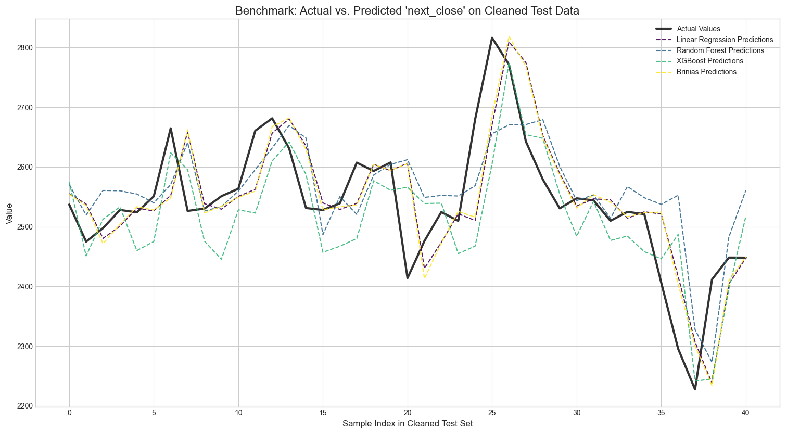

# Brinias-engine: Symbolic Modeling Engine - User Guide

brinias-engine is a powerful Python library that uses Genetic Programming to automatically discover mathematical formulas that model your data. It can be used for both regression (predicting a number) and classification (predicting a category) tasks.

The key output is a simple, human-readable mathematical equation that represents the learned model.

### Core Features

*   **Symbolic Regression & Classification:** Finds the underlying formula in your data.
*   **Automated Feature Preprocessing:** Handles numerical, categorical, and text data automatically.
*   **Simple API:** Train a model and make predictions with just two main functions.
*   **Portable Models:** Exports the final formula into a standalone Python file (`generated_model.py`) that can be used anywhere without needing the `brinias-engine` library.
*   **Transparent & Interpretable:** The final model is a clear equation, not a black box.

## 1. Installation

To get started, you need `git` and `python >= 3.7` installed on your system.


**Strongly recommended to create a virtual env before using it.
 ```
python3 -m venv .venv
source .venv/bin/activate

```

1.  **Clone the Repository:**
    Open your terminal and clone the project from its repository.
    ```bash
    git clone https://github.com/brinias/brinias-engine.git
    cd brinias-engine # Navigate into the project's root directory
    ```

2.  **Install the Library:**
    Install the library in "editable" mode. This allows you to make changes to the source code and have them immediately apply without reinstalling.
    ```bash
    pip install -e .
    ```
    This command reads the `setup.py` file and installs `brinias-engine` along with all its dependencies (`pandas`, `scikit-learn`, etc.).

You are now ready to use the library!

## 2. The Main Workflow

Using `brinias-engine` is a simple, two-step process:
1.  **Train a Model** on your dataset.
2.  **Make Predictions** using new data.

We will use the `examples/training.py` script as our guide.

### Step 1: Training a Model

The `train_model` function is the heart of the library. It takes your CSV data, finds the best formula, and saves all the resulting model files.

#### Function Signature:
`brinias.train_model(csv_path, target_column, output_dir, ...)`

#### Key Parameters:
*   `csv_path` (str): **Required.** The full path to your training data file (e.g., `"data/my_data.csv"`).
*   `target_column` (str): **Required.** The name of the column in your CSV that you want to predict (e.g., `"price"`).
*   `output_dir` (str): The name of the folder where all model files will be saved. Defaults to `"brinias_model_files"`. It's highly recommended to give each model a unique name (e.g., `"eth_price_model"`).
*   `generations` (int): The number of evolutionary cycles to run. **More generations lead to better models but take longer.** Start with `50-100` for testing and use `200+` for serious results. Defaults to `50`.
*   `pop_size` (int): The number of formulas competing in each generation. Larger populations explore more possibilities. Defaults to `100`.
*   `cv_folds` (int): The number of cross-validation folds to use for evaluating formulas. This prevents overfitting. Defaults to `5`.
*   `seed` (int): A random seed for reproducibility. Defaults to `42`.

#### Example Training Script:
This code trains a model using the provided `dataeth.csv` dataset.

```python
# From examples/training.py
from brinias import train_model

print("--- STARTING MODEL TRAINING ---")

# Define the training parameters
train_model(
    csv_path="dataeth.csv",
    target_column="next_close",
    output_dir="next_close",
    generations=120,   # Use a small number for a quick test
    pop_size=100,
    show_plot=True    # Display a plot of actual vs. predicted after training
)

print("--- TRAINING COMPLETE ---")
```
When you run this, `brinias` will start the evolutionary process, printing the progress for each generation.

#### What Happens After Training?
A new folder named **`my_first_brinias_model`** will be created. It contains everything needed to use your model:

*   `generated_model.py`: A standalone Python script containing your model's formula. **This is your portable model.**
*   `equation.txt`: A simple text file with the raw mathematical expression.
*   `vectorizers.pkl`, `label_encoder.pkl`, `threshold.pkl`, etc.: Helper files that store the data preprocessing steps. You don't need to interact with these directly.
*   `evolution_history.csv`: A log of the model's performance during training.

### Step 2: Making Predictions

Once the model is trained, you can use the `make_prediction` function to predict outcomes for new, unseen data.

#### Function Signature:
`brinias.make_prediction(input_data, model_dir)`

#### Key Parameters:
*   `input_data` (dict): **Required.** A Python dictionary where keys are the feature names (column headers from your original CSV) and values are the corresponding data points for a single prediction.
*   `model_dir` (str): **Required.** The path to the folder created during training (e.g., `"next_close"`).

#### Example Prediction Script:

```python
# From examples/predict.py
from brinias import make_prediction

print("--- MAKING A NEW PREDICTION ---")

# Create a dictionary with a new data point
# The keys MUST match the column names from your training CSV
new_data_point = {
   "timestamp": "2025-05-14",
   "Open": 2679.71,
   "High": 2725.99,
   "Low": 2547.26,
   "Close": 2609.74,
   "Volume": 830047.1122,
}

# Call the prediction function
prediction = make_prediction(
    input_data=new_data_point,
    model_dir="next_close" # Must match the output_dir from training
)

print("\n--- Prediction Result ---")
print(prediction)

# Example of how to use the result
if prediction.get('prediction_type') == 'classification':
    print(f"The predicted label is: {prediction.get('predicted_label')}")
```
The function will return a dictionary containing the prediction.

*   **For classification**, it will look like:
    `{'prediction_type': 'classification', 'predicted_class': 1, 'raw_score': 0.89, 'predicted_label': 'UP'}`
*   **For regression**, it will look like:
    `{'prediction_type': 'regression', 'predicted_value': 1850.75}`

## 3. Troubleshooting

*   **`ModuleNotFoundError: No module named 'brinias'`**
    *   Make sure you ran `pip install -e .` from the project's root directory.
    *   Ensure your terminal is open in the project's root directory (`brinias-project/`) when running your scripts.

*   **`FileNotFoundError: [Errno 2] No such file or directory: 'my_data.csv'`**
    *   Check that the `csv_path` in `train_model` is correct. Provide either a relative path from where you are running the script or a full, absolute path.

*   **`ValueError: Input data is missing expected column: 'Some_Column'`**

    *   The dictionary you pass to `make_prediction` must contain a key for *every single feature column* that was in your original training CSV (except the target column). Double-check for typos or missing keys.


## 📊 Benchmark Results

To demonstrate the effectiveness of `Brinias-engine`, a fair benchmark was conducted against several standard regression models.

These results are from a challenging test where the training and testing datasets (`dataeth.csv` and `dataeth2.csv`) are separated to better evaluate the models' ability to generalize to unseen data. The goal is to predict the `next_close` price of Ethereum.

### Performance Metrics

The table below shows that **Brinias-engine achieved the lowest Mean Squared Error (MSE) and the highest R² Score**, indicating the most accurate and reliable predictions.

| Model               | Time (s)   | MSE         | R² Score |
|---------------------|------------|-------------|----------|
| **Brinias-engine**  | `244.17`   | `5972.45`   | `0.4801` |
| Linear Regression   | `0.00`     | `6161.01`   | `0.4637` |
| XGBoost             | `0.17`     | `7319.93`   | `0.3628` |
| Random Forest       | `0.15`     | `7394.59`   | `0.3563` |

### Visual Comparison

The plot below visually confirms the results. The yellow line (`Brinias Predictions`) frequently tracks the black line (`Actual Values`) more closely than the other models.



### Conclusion

Even on a more difficult and realistic dataset, **Brinias successfully discovered a symbolic formula that outperformed standard machine learning models.** Its ability to find complex, non-linear relationships makes it a powerful tool for financial time-series analysis and other regression tasks where interpretability and accuracy are paramount.

---
*To reproduce these results, run the `benchmark.py` script located in the `examples/` directory.*